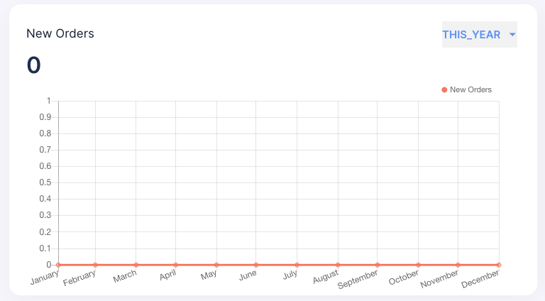

# Serverless Framework Take Home Assessment

## Prereqs

- Docker, npm, python and [serverless](https://www.serverless.com/framework/docs/getting-started) must be installed locally

## Usage and Setup

1. Run `npm install` and `python install -r requirements.txt` to install python(via virtual environment) and node dependencies
2. Run `docker compose up` to start the database on `losthost:3306`
3. Run `make serverless-offline` to start the server locally on port `8080` OR run `serverless invoke local --function get_all_orders`

## Testing Tasks

### Setup git repository and PR changes

1. Create a new git repository named `example-co-orders-service`
2. Create a branch named `develop` and this must be your `default` branch
3. All changes made in this repo will be done via a new branch and a Pull Request to the `develop` branch. Please add `malachany` as the reviewer of all PRs for this test

### Fix migration issues

1. There is an issue with the database migrations using alembic. Fix the issue and document exactly how you fixed the issue

### Create services endpoint

1. Create an endpoint to grab a service by id
2. Create an endpoint to grab a list of all services

### Create orders endpoint

#### HINTS

- Use alembic to manage tables being added/updated in database
- `handler.py` has starter code for you to get started with

1. Create an `orders` table using SQLAlchemy (to be used the for the next step).
2. Create an `order_items` table
   1. Must have a relationship with the orders table to know what order the item belongs to
   2. Must have a relationship that states what service the order item is for
3. Create endpoints to create, read, update, and delete orders from the database running on `localhost:3306`
   1. The create and update endpoints must accept in the request which services to add to the order and a user cannot update a deleted order
   2. The read endpoints should be one that lists all the orders and one that describes a single order with all the order items
   3. The read endpoint must respond with a list of all order items for the order and cannot return a deleted order
   4. The delete endpoint must not delete the order, but set a `status` column to deleted on the row
4. Create an endpoint that can be used by the frontend to display the number of created orders over time
   1. The frontend should be able to specify the time period (one of `[THIS_WEEK, THIS_MONTH, THIS_YEAR]`), and the endpoint should return data for this time period in buckets
   2. An example of how this view would look on the frontend is included below:
      1. 

### Serverless updates

1. Update the function timeout time to 30 seconds [https://www.serverless.com/framework/docs/providers/aws/guide/serverless.yml/]

### Python tests

1. Create tests for your code using pytest `make test` and ensure your code passes the pylist check `make test-style`
